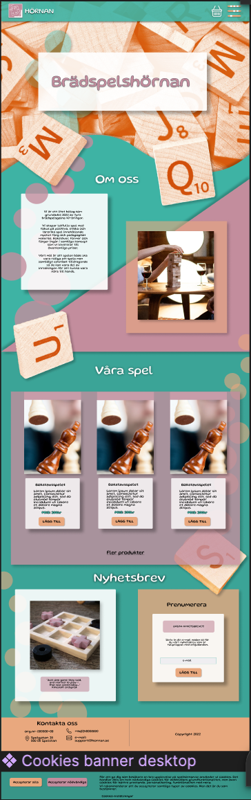
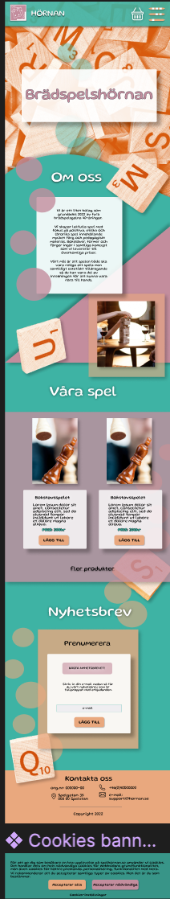

<h1> Bradspelshörnan </h1>

<h2> Från design till kod </h2>

<h4> Live at https://joelhagg.github.io/bradspelshornan/ </h4>

<h3> Arbete under kursen Grafiska verktyg - Design är gjord av en klasskamrat i Figma och uppgiften var att koda den så likt som möjligt 😅  
Det största arbetet var att få sidan responsiv i olika lägen
</h3>

 
 

    
    

